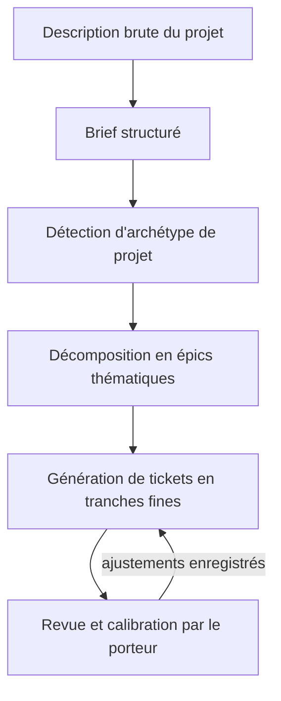
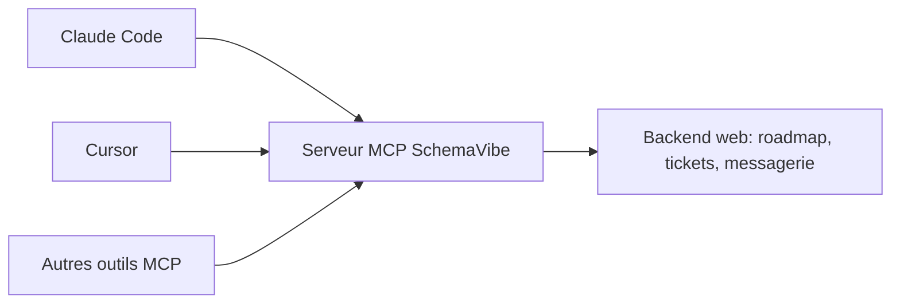
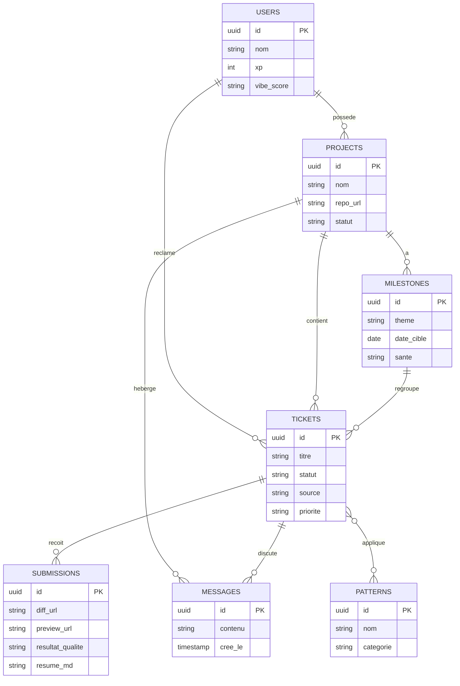
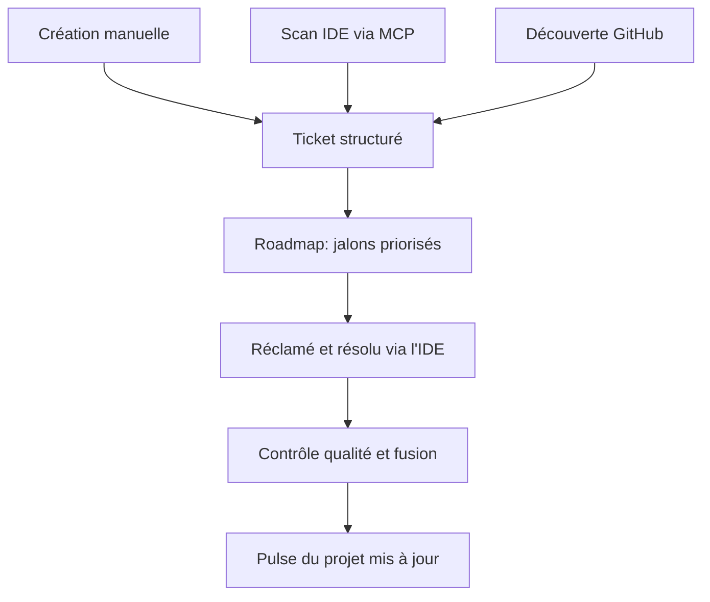

# Cahier des charges — SchemaVibe

> Document vivant. Ce fichier est destiné à être fourni à Claude Code pour amorcer le développement de la plateforme. Il est mis à jour au fil des échanges de conception — chaque nouvelle notion discutée y est ajoutée pour garder une traçabilité complète des décisions.

**Dernière mise à jour :** 2026-09-16
**Statut :** Concept validé, pré-MVP
**Nom du projet :** SchemaVibe (validé)

---

## 1. Vision

SchemaVibe transforme le vibe coding — aujourd'hui une pratique solitaire et peu structurée — en un **workflow collaboratif, traçable et gamifié**, à mi-chemin entre GitHub Issues, une plateforme de bounties (type Gitcoin) et un catalogue de design patterns pour le prompting.

**Proposition de valeur en une phrase :** des projets vivants exposent des tickets/tâches précis, que des développeurs résolvent avec l'outil de vibe coding de leur choix, en s'appuyant sur des patterns éprouvés et un contrôle qualité automatisé — le tout visible et mesurable en temps réel.

---

## 2. Contexte de marché

- 92 % des développeurs américains utilisent quotidiennement des outils d'IA pour coder, mais seulement 29 % font confiance au code produit — c'est l'écart de confiance que SchemaVibe cible directement.
- Marché estimé à 4,7 milliards de dollars en 2026.
- 87 % des entreprises du Fortune 500 utilisent déjà le vibe coding sous une forme ou une autre.
- La part de code généré par IA est passée de 10 % (2023) à 46 % (2026).
- 63 % des utilisateurs des outils de vibe coding ne sont pas des développeurs — un vivier de projets mal engagés qui auront besoin d'être professionnalisés.
- Phénomène émergent : la "SaaSpocalypse" — remise en cause de tout produit SaaS reproductible en moins de 500 lignes de code généré par IA.
- Plusieurs listes GitHub "awesome-vibe-coding" existent déjà (376 à ~800 stars) mais ce sont toutes des README statiques, curées manuellement — aucune plateforme interactive et collaborative n'existe encore sur ce créneau. C'est l'espace que SchemaVibe vise à occuper.

---

## 3. Proposition de valeur et différenciation

| Axe | Solutions existantes | SchemaVibe |
|---|---|---|
| Structure | Prompt libre, sans méthode | Bibliothèque de patterns catalogués |
| Collaboration | Solitaire (Bolt, Lovable, v0...) | Tickets, roadmap, messagerie multi-contributeurs |
| Confiance | Pas de garde-fou qualité | Contrôle qualité automatisé + Vibe Score |
| Outils | Verrouillé à un éditeur | Agnostique, via un serveur MCP partagé |
| Visibilité | Projet invisible tant qu'il n'est pas fini | Dashboard "pulse" en temps réel |

---

## 4. Personas

- **Porteur de projet** — a une idée ou un projet vibe-codé existant mais mal engagé, poste des tickets, définit la roadmap, valide les soumissions.
- **Développeur contributeur** — réclame des tickets, les résout avec l'outil de son choix, construit sa réputation et son "Vibe Score".
- **Agence de "sauvetage de MVP"** — utilise SchemaVibe en marque blanche pour livrer des prestations de professionnalisation de projets vibe-codés.

---

## 5. Fonctionnalités clés

### 5.1 Le ticket vivant

Chaque ticket contient : contexte, critères d'acceptation, lien vers un aperçu live (avant/après), pattern(s) recommandé(s), historique des tentatives précédentes.

**Definition of Ready** — un ticket ne passe de brouillon à ouvert que s'il réunit :
- Contexte + critère d'acceptation explicite (jamais "améliorer X")
- Au moins un pattern suggéré
- Complexité estimée (S/M/L)
- Si généré automatiquement : un score de confiance affiché
- Critère de test explicite (voir section 21) — ce qui doit être vrai pour considérer le ticket terminé

### 5.2 Bibliothèque de patterns de vibe coding

| Pattern | Principe | Cas d'usage |
|---|---|---|
| Spec-First | Rédiger un mini cahier des charges avant de prompter | Tickets complexes/multi-fichiers |
| Modular Prompting | Découper feature par feature | Toute construction incrémentale |
| Test-Gated Iteration | Écrire les tests avant, laisser l'IA itérer dessus | Logique métier critique |
| Context Anchoring | Attacher les fichiers/contexte pertinents avant de prompter | Codebase existante |
| Review-Refine Loop | Diff → revue humaine → reprompt ciblé | Toujours |
| Guardrail Prompting | Contraintes de sécurité embarquées dans le prompt | Auth, paiement, données sensibles |
| Multi-Agent Orchestration | Agent spec + agent codeur + agent reviewer | Projets volumineux |
| Regression Radius | Identifier et retester les zones adjacentes à la modification, pas seulement le périmètre du ticket | Toute codebase au-delà de quelques centaines de lignes |

Chaque ticket résolu tague les patterns utilisés, ce qui construit une base de connaissance empirique ("pour ce type de ticket, ce pattern a le meilleur taux de succès").

### 5.3 Agnostique côté outils

Aucune dépendance à un seul éditeur IA. Intégration via un serveur MCP partagé (voir section 8) — compatible Claude Code, Cursor, et tout outil MCP.

### 5.4 Dashboard "pulse" — rendre le projet visible et vivant

- Activité en temps réel : tickets en cours, preview live qui se met à jour
- Mode "regarde-le construire" : flux (ou replay) du diff pendant la résolution d'un ticket
- Graphe de vitalité : tickets fermés, prompts exécutés, patterns mobilisés

### 5.5 Gamification et réputation

XP par ticket résolu, badges par pattern maîtrisé, leaderboards par stack technique, "Vibe Score" (rapidité + qualité + revue par les pairs).

### 5.6 Garde-fou qualité

Chaque soumission passe par une porte de qualité automatisée (lint, tests, scan de sécurité type Semgrep) avant fusion. Positionnement clé face à l'écart de confiance mesuré sur le marché (section 2).

**Vibe Security Gate** — le scan de sécurité n'est pas une simple étape du contrôle qualité parmi d'autres, mais une porte bloquante nommée et distincte : toute soumission touchant à l'auth, aux paiements ou aux données utilisateurs doit passer un scan SAST dédié avant même d'atteindre la revue humaine. Ce choix est directement motivé par la veille de marché (section 25) : les failles de sécurité restent, de loin, le risque le plus documenté du vibe coding non encadré.

### 5.7 Marketplace et bounties

Bounties (argent ou réputation) postées par les porteurs de projet. Modèle économique : commission sur bounty, abonnement porteur de projet (tickets privés, priorité), certification/parcours d'apprentissage, mode agence en marque blanche.

---

## 6. Idées complémentaires validées

- **Vibe Debt Auditor** — scanne un projet déjà vibe-codé (export Bolt/Lovable, repo) et génère automatiquement un backlog priorisé de dette technique et de failles de sécurité. Sert à la fois de moteur d'acquisition (remplit le marketplace de demande réelle) et de produit vendable en soi.
- **Marketplace de pipelines d'agents** — les devs avancés publient des configurations réutilisables (règles Cursor, sous-agents Claude Code) liées à des types de tickets précis.
- **Défis "pattern de la semaine"** — façon Advent of Code, pour driver l'engagement communautaire.
- **Mode agence** — white-label du système de tickets pour les livrables clients des agences de "sauvetage de MVP".
- **Création de ticket en langage naturel** — décrire un besoin en une phrase, le système structure le ticket automatiquement (voir section 7 pour le mécanisme complet côté génération de backlog).
- **Génération de données de test synthétiques** par ticket, en s'appuyant sur des techniques de génération de données synthétiques.
- **Contributeurs mixtes — humains et agents autonomes** — un ticket ouvert peut être réclamé par un développeur humain ou dispatché vers un agent autonome connecté (à la manière d'OpenHands ou SWE-agent, qui résolvent déjà des issues GitHub de façon autonome). L'agent produit un premier brouillon qui passe par les mêmes portes de qualité (section 5.6) et la même revue humaine avant fusion — SchemaVibe n'entre pas en concurrence avec ces agents, il les orchestre et leur ajoute la couche de confiance et de traçabilité qui leur manque en solo. Un **garde-fou d'exécution** (nombre d'itérations et budget maximum par tentative, arrêt automatique et escalade vers un humain au-delà) est indispensable — un agent sans supervision peut boucler indéfiniment sur un test qui échoue sans que personne ne s'en aperçoive.
- **Signal de positionnement lors du brief** — à l'étape "Brief structuré" (section 7), signaler légèrement si le projet décrit ressemble à un archétype d'application grand public déjà saturé, et suggérer d'envisager un positionnement plus étroit. Idée exploratoire, à ne pas transformer en conseil business intrusif — un simple signal, jamais un blocage.

---

## 7. Génération de backlog à partir d'une simple description (démarrage à froid)

**Problème à résoudre :** un porteur de projet arrive avec uniquement une description en langage naturel (aucun code existant). Comment générer un backlog de tickets structuré et actionnable ?

**Approche retenue :** pas de modèle entraîné spécifiquement — un pipeline orchestré de plusieurs appels LLM à sortie structurée, chacun vérifiable, plutôt qu'une génération en un seul prompt.



### Étape 1 — Brief structuré
Un agent d'extraction transforme la description brute en objet structuré : objectif, personas, entités du domaine, parcours utilisateurs clés, contraintes, stack préférée (optionnelle), critères de succès. Si des informations bloquantes manquent, l'agent pose 2-3 questions ciblées plutôt que de deviner.

### Étape 2 — Détection d'archétype de projet
Le brief est comparé à une **bibliothèque d'archétypes de projet** maintenue en interne (marketplace, SaaS à tableau de bord, plateforme de contenu, outil interne, API/service, système de réservation, e-commerce...), chacun avec un découpage en épics de référence. C'est le pendant "architecture" de la bibliothèque de patterns d'exécution (section 5.2).

### Étape 3 — Décomposition en épics thématiques
L'archétype propose un squelette d'épics, ajusté selon le brief. Un "Ticket 0" de mise en place (init repo, CI, stack de base) est systématiquement généré en premier.

### Étape 4 — Génération de tickets en tranches fines
Découpage vertical (bout-en-bout) plutôt qu'horizontal (par couche technique) : "un visiteur peut créer un compte et se connecter" plutôt que "créer le schéma de la table users". Chaque ticket généré reçoit automatiquement : titre, description, critères d'acceptation en première version, pattern(s) suggéré(s), complexité estimée, dépendances suggérées.

### Étape 5 — Revue et calibration
Rien n'est publié automatiquement. Le porteur valide, modifie, fusionne ou supprime chaque ticket proposé dans une interface de revue légère. Ses ajustements sont réinjectés en contexte (few-shot par projet, pas de fine-tuning global) pour calibrer les générations suivantes sur ce même projet.

### Réutilisation en continu
Une fois le projet lancé, une nouvelle demande en langage naturel du porteur relance uniquement les étapes 1 et 4 sur le périmètre concerné, sans régénérer tout le backlog.

---

## 8. Architecture d'intégration outils

Un seul **serveur MCP** (Model Context Protocol) exposé par la plateforme, plutôt qu'une intégration séparée par outil. Claude Code et Cursor supportent tous deux MCP nativement.



**Outils exposés par le serveur MCP :**
- `scan_repo` — analyse locale (densité de commits, couverture de tests, TODO, audit de dépendances) et génère un backlog candidat
- `create_tickets` — pousse des tickets vers la plateforme (jamais sans confirmation explicite)
- `claim_ticket` — réclame un ticket et récupère son contexte (critères, pattern suggéré)
- `submit_solution` — pousse un diff + résultats de tests locaux comme soumission, et génère un résumé structuré en Markdown du travail effectué (fichiers modifiés, décisions prises, tests ajoutés), stocké dans le champ `resume_md` de la soumission (section 9) — jamais comme fichier séparé dans le repo, cohérent avec la section 23. Ce résumé s'affiche directement sur la page du ticket, pour que le porteur de projet voie ce qui a été fait sans lire le diff brut.

**Commandes Claude Code proposées :**
- `/schemavibe scan` — lance `scan_repo`, affiche un aperçu, ne pousse rien sans confirmation
- `/schemavibe work <id>` — récupère le contexte du ticket dans la session
- `/schemavibe submit` — pousse le diff comme soumission, avec son résumé Markdown généré automatiquement

**Cursor** — même logique en ajoutant simplement le serveur MCP dans ses paramètres, aucune commande custom à écrire.

---

## 9. Modèle de données logique



Note : les cinq entités centrales (Users, Projects, Milestones, Tickets, Submissions) suffisent pour un MVP. Messages et Patterns s'ajoutent sans rien casser.

---

## 10. Cycle de vie d'un ticket



---

## 11. Méthodologie de construction de roadmap

- Les jalons sont des **thèmes** (ex. "Sécurisation", "Stabilisation", "Nouvelles fonctionnalités"), pas juste des dates.
- Chaque ticket rattaché à un jalon porte des dépendances explicites (bloqué par / débloque).
- La progression d'un jalon se recalcule automatiquement à partir du statut de ses tickets.
- Un indicateur de santé (à jour / à risque / bloqué) se déclenche automatiquement si la vélocité ralentit.

---

## 12. Modèle de collaboration

L'entité **Messages** (section 9) est rattachée soit à un projet (canal général — annonces, discussions transverses), soit à un ticket (fil dédié — questions techniques, revue de soumission). Un seul système, deux contextes.

---

## 13. Découverte de dépôts GitHub problématiques — cadre éthique

Le scanner peut identifier des signaux publics (rafales de commits typiques d'une session de vibe coding, absence de tests, mentions de Bolt/Lovable/Claude dans le README, activité qui s'arrête brutalement) pour faire remonter des **opportunités**.

**Règle stricte :** jamais de création ou publication de tickets sur un dépôt sans l'accord explicite du propriétaire.

**Flux retenu :**
1. Détection automatique
2. Entrée dans un flux interne "Découvertes non réclamées"
3. Invitation envoyée au propriétaire si identifiable
4. Le propriétaire "réclame" son projet et choisit ce qu'il ouvre publiquement

---

## 14. Faisabilité et risques

**Points forts :**
- Stack techniquement accessible : marketplace + système de tickets + couche de scoring qualité automatisé
- Besoin de "filet de sécurité" documenté (écart 92 %/29 %, section 2), pas hypothétique
- Sujet mainstream en 2026, pas d'évangélisation nécessaire
- Preuves de marché supplémentaires (veille section 25) : une étude sur 470 pull requests montre que le code co-écrit par IA contient 1,7 fois plus de problèmes majeurs que le code humain, avec des vulnérabilités de sécurité 2,74 fois plus fréquentes — la Vibe Security Gate (section 5.6) répond directement à ce chiffre
- Le "fix-one-break-ten" (un correctif qui en casse dix autres) est la frustration la plus citée par les développeurs sur Reddit au-delà de quelques centaines de lignes — justifie le pattern Regression Radius (section 5.2)

**Risques identifiés :**
- Problème de l'œuf et de la poule (marketplace) → mitigé par le Vibe Debt Auditor qui génère de la demande automatiquement
- Fragmentation des outils → mitigé par l'approche MCP unique (section 8)
- Contrôle qualité à l'échelle → nécessite une conception transparente du scoring, pas juste un badge pass/fail
- Monétisation à valider : commission bounty, abonnement porteur de projet, certification, marque blanche agence
- Concurrence indirecte des agents autonomes open source (OpenHands, SWE-agent — voir section 25) → mitigé en les traitant comme des contributeurs possibles plutôt que des concurrents (section 6)
- Le vrai goulot d'étranglement du vibe coding n'est pas toujours technique : une analyse de plusieurs milliers de posts Reddit identifie la distribution (trouver des utilisateurs) comme la douleur n°1, avant les bugs — SchemaVibe reste positionné sur l'exécution technique, pas sur la mise en marché, mais ce signal justifie l'idée exploratoire de la section 6

---

## 15. Roadmap de développement MVP

| Phase | Contenu |
|---|---|
| 1. Discovery & validation | Interviews (15-20 devs, 5 porteurs de projets vibe-codés), choix de la niche de lancement |
| 2. Boucle core du MVP | Auth, projets, CRUD tickets, claim, soumission (diff + preview live), dashboard pulse basique, 6-8 patterns documentés |
| 3. Couche qualité & confiance | Lint/tests automatisés via webhooks, Vibe Score, badges/XP |
| 4. Marketplace & acquisition | Bounties (Stripe Connect), lancement du Vibe Debt Auditor comme outil gratuit d'acquisition |
| 5. Intégrations natives & scale | Connecteurs Claude Code / Cursor natifs (serveur MCP), mode agence en marque blanche |

---

## 16. Glossaire

- **Ticket** — unité de travail précise, avec critères d'acceptation et pattern(s) suggéré(s)
- **Jalon (milestone)** — regroupement thématique de tickets avec dépendances et santé calculée
- **Pattern** — pratique de prompting documentée et réutilisable
- **Archétype de projet** — modèle de découpage en épics propre à un type de projet (marketplace, SaaS, etc.)
- **Vibe Score** — score composite (rapidité + qualité + revue par les pairs) d'un contributeur
- **Brief structuré** — représentation structurée d'une description de projet en langage naturel

---

## 17. Choix technique : langage et stack

| Critère | TypeScript unifié (Next.js + Supabase + MCP Node) | Python (FastAPI) + frontend séparé | Monolithe Python (Django) |
|---|---|---|---|
| Cohérence stack | Un seul langage sur tout le projet (front, back, serveur MCP) | Deux langages, deux jeux de conventions | Un seul langage, mais frontend limité |
| SDK MCP | SDK officiel Node/TS, le plus mature | SDK Python existe, moins utilisé en production | Idem Python |
| Intégration Supabase | Client JS natif, Realtime au premier plan | Client Python correct mais moins complet sur Realtime | Idem Python |
| Dashboard temps réel (pulse) | Next.js + Supabase Realtime = combo standard | Pont supplémentaire nécessaire côté WebSocket | Peu naturel |
| Risque d'erreur pour Claude Code | Un seul jeu de conventions à respecter partout | Plus de surface d'incohérence entre les deux langages | Conventions strictes mais UI pauvre |
| Vitesse de développement solo | Rapide, un seul environnement | Plus lent, deux environnements à maintenir | Rapide côté back, lent côté UI moderne |

**Décision : TypeScript de bout en bout.** Next.js pour le web (frontend + Server Actions), Node.js pour le serveur MCP, Supabase comme couche de persistance. Un seul langage sur l'ensemble du projet réduit directement le risque que Claude Code applique des conventions différentes d'un module à l'autre.

---

## 18. Architecture applicative et organisation du code

Organisation en **monorepo**, par feature métier plutôt que par couche technique — un ticket qui touche "les tickets" ne modifie qu'un seul dossier, jamais dispersé entre des couches transversales.

```
schemavibe/
├── apps/
│   ├── web/                      # Application Next.js (App Router)
│   │   ├── app/                  # Routes (pages, layouts)
│   │   ├── features/             # Modules métier
│   │   │   ├── tickets/
│   │   │   │   ├── components/
│   │   │   │   ├── actions/      # Server Actions
│   │   │   │   ├── repository/   # Accès Supabase typé
│   │   │   │   └── schema.ts     # Schémas Zod
│   │   │   ├── projects/
│   │   │   ├── milestones/
│   │   │   ├── patterns/
│   │   │   ├── messaging/
│   │   │   └── auth/
│   │   ├── components/ui/        # Composants partagés (design system)
│   │   ├── lib/                  # Client Supabase, helpers
│   │   └── supabase/
│   │       ├── migrations/
│   │       └── seed.sql
│   └── mcp-server/                # Serveur MCP (Node/TS), déployé séparément
│       ├── tools/
│       │   ├── scan-repo.ts
│       │   ├── create-tickets.ts
│       │   ├── claim-ticket.ts
│       │   └── submit-solution.ts
│       └── lib/
├── packages/
│   └── shared-types/               # Types partagés entre web et mcp-server
├── docs/
│   ├── schemavibe-cahier-des-charges.md
│   └── adr/                        # Architecture Decision Records
│       └── 0001-choix-typescript-unifie.md
├── README.md
└── CHANGELOG.md
```

**Pattern en couches à l'intérieur de chaque feature :**
1. **Composants** (présentation) — React Server/Client Components
2. **Server Actions** (orchestration) — validation + appel au repository
3. **Repository** (accès aux données) — seule couche autorisée à appeler `supabase.from(...)`
4. **Supabase** (persistance)

**Règle stricte :** aucun composant ni Server Action n'appelle directement le client Supabase — tout passe par une fonction du repository, typée. C'est le pattern Repository : un seul point de changement si le schéma évolue, et ça empêche Claude Code de disperser des requêtes brutes dans la codebase.

**Validation schema-first (Zod)** — chaque entité a un schéma Zod unique, partagé entre le formulaire client, la Server Action et le repository. Le nom du projet prend ici un sens concret : SchemaVibe applique le principe schema-first à son propre code, pas seulement à ses tickets.

---

## 19. Conventions de code

- TypeScript strict (`strict: true`, jamais de `any` implicite)
- Fichiers et dossiers : kebab-case (`ticket-card.tsx`)
- Composants et types : PascalCase (`TicketCard`, `type Ticket`)
- Variables et fonctions : camelCase (`createTicket`, `isReady`)
- Constantes globales : SCREAMING_SNAKE_CASE (`MAX_TICKET_TITLE_LENGTH`)
- Base de données (Postgres/Supabase) : snake_case, tables au pluriel (`tickets`, `milestones`)
- Commits : Conventional Commits, préfixés par l'ID du ticket — ex. `feat(SV-004): ajouter le CRUD tickets`
- Une branche = un ticket = une pull request

---

## 20. Intégration Supabase

**Pourquoi Supabase :** Postgres géré, Auth intégrée, Realtime pour le dashboard pulse (section 5.4), et Storage si besoin de fichiers — couvre l'ensemble du modèle de données (section 9) sans service tiers supplémentaire.

**Connexion à Claude Code via MCP :**
```
claude mcp add supabase --transport http "https://mcp.supabase.com/mcp?project_ref=<project-ref>"
claude /mcp   # puis sélectionner "supabase" → "Authenticate"
```
Alternative via le plugin officiel Anthropic :
```
claude plugin marketplace add anthropics/claude-plugins-official
claude plugin install supabase@claude-plugins-official
```
En développement local (Supabase CLI), le serveur MCP est disponible sur `http://localhost:54321/mcp`. Une fois connecté, Claude Code peut inspecter le schéma, exécuter des migrations et interroger les tables directement en langage naturel.

**Realtime :** le dashboard pulse (section 5.4) s'abonne aux canaux Supabase Realtime sur les tables `tickets` et `submissions` pour l'activité en temps réel, sans polling.

---

## 21. Stratégie de test

- **Tests unitaires** (Vitest) — logique pure : détection d'archétype, calcul du Vibe Score, validation de la Definition of Ready
- **Tests d'intégration** — fonctions du repository contre une instance Supabase locale (CLI Supabase, Docker)
- **Tests end-to-end** (Playwright) — parcours complets : créer un projet → générer un backlog → réclamer un ticket → soumettre → fusionner
- **Tests de contrat** pour le serveur MCP — le schéma d'entrée/sortie de chaque outil (`scan_repo`, `create_tickets`, `claim_ticket`, `submit_solution`) doit être vérifié automatiquement, puisque Claude Code en dépend directement

Chaque ticket porte un **critère de test** explicite (section 5.1) : ce qui doit être vrai pour que le ticket soit considéré comme terminé.

---

## 22. Backlog de démarrage — tickets SV-000 à SV-011

Ce backlog applique à SchemaVibe sa propre méthodologie : chaque ticket respecte la Definition of Ready (section 5.1) et peut être donné tel quel à Claude Code, un par un, dans l'ordre des dépendances.

| ID | Titre | Résumé | Complexité | Dépend de | Pattern suggéré |
|---|---|---|---|---|---|
| SV-000 | Initialisation du projet | Monorepo, Next.js, Supabase local, CI de base | S | — | Spec-First |
| SV-001 | Authentification | Inscription/connexion via Supabase Auth | M | SV-000 | Guardrail Prompting |
| SV-002 | Schéma de données initial | Migrations Supabase pour les 7 entités (section 9) | M | SV-000 | Spec-First |
| SV-003 | CRUD Projets | Créer, lister, consulter un projet | M | SV-002 | Modular Prompting |
| SV-004 | CRUD Tickets | Créer, lister, consulter un ticket avec Definition of Ready | M | SV-002, SV-003 | Modular Prompting |
| SV-005 | Réclamer un ticket | Un utilisateur réclame un ticket ouvert | S | SV-004 | Test-Gated Iteration |
| SV-006 | Soumission de solution | Lien diff + preview live, statut du ticket mis à jour | M | SV-005 | Review-Refine Loop |
| SV-007 | Dashboard pulse | Activité récente en temps réel via Supabase Realtime | L | SV-004, SV-006 | Modular Prompting |
| SV-008 | Bibliothèque de patterns | Seed des 7 patterns + affichage sur un ticket | S | SV-004 | Spec-First |
| SV-009 | Jalons et roadmap | CRUD des jalons, rattachement aux tickets, progression calculée | L | SV-004 | Multi-Agent Orchestration |
| SV-010 | Messagerie | Canal projet + fil par ticket | M | SV-003, SV-004 | Modular Prompting |
| SV-011 | Serveur MCP — scan_repo (v1) | Premier outil MCP : analyse locale basique + aperçu de tickets | L | SV-004 | Guardrail Prompting |

### Exemples détaillés

**SV-000 — Initialisation du projet**
- Contexte : poser les fondations techniques avant tout développement fonctionnel
- Critères d'acceptation :
  - Monorepo pnpm workspaces (`apps/web`, `apps/mcp-server`, `packages/shared-types`)
  - Next.js (App Router, TypeScript strict) initialisé dans `apps/web`
  - Projet Supabase créé, CLI Supabase configurée en local
  - ESLint + Prettier configurés selon la section 19
  - CI GitHub Actions : lint + build à chaque push
- Critère de test : `pnpm build` et `pnpm lint` passent sans erreur sur un commit vide

**SV-004 — CRUD Tickets**
- Contexte : permettre de créer, lister et consulter un ticket, avec la Definition of Ready de la section 5.1
- Critères d'acceptation :
  - Formulaire de création : titre, contexte, critères d'acceptation, pattern(s) suggéré(s), complexité
  - Un ticket ne passe en statut "ouvert" que si tous les champs de la Definition of Ready sont renseignés
  - Liste filtrable par statut et par projet, page de détail complète
- Critère de test : test d'intégration vérifiant qu'un ticket incomplet reste bloqué en "brouillon" ; test e2e du parcours de création complet

**SV-011 — Serveur MCP : outil scan_repo (v1)**
- Contexte : premier outil du serveur MCP (section 8), permet à Claude Code de scanner un repo local et proposer un backlog
- Critères d'acceptation :
  - Outil `scan_repo` conforme au SDK `@modelcontextprotocol/sdk`
  - Analyse : densité de commits récents, présence de tests, TODO non résolus
  - Résultat structuré, jamais poussé automatiquement — confirmation explicite requise (section 8)
  - Commande Claude Code `/schemavibe scan` fonctionnelle en local
- Critère de test : test de contrat vérifiant le schéma de sortie de l'outil contre un repo de test fixture

---

## 23. Directives pour les fichiers Markdown

Ce cahier des charges reste le **fichier de référence principal** qui pilote l'ensemble du projet — c'est lui qui contient la vision, l'architecture, les conventions et le backlog. Les fichiers listés ci-dessous (README, CHANGELOG, ADR) sont secondaires, chacun avec un rôle étroit, et ne dupliquent jamais son contenu. La section 24 détaille le protocole que ce fichier impose à Claude Code pour l'exécution du backlog de démarrage.

Les agents IA ont tendance à multiplier les fichiers `.md` au fil du travail (`NOTES.md`, `TODO.md`, un README par composant...). Pour éviter cette dérive, seuls les types de fichiers Markdown ci-dessous sont autorisés — chacun avec un rôle, un emplacement et une règle de nommage fixes. Rien d'autre n'est créé sans validation explicite du porteur du projet.

### Fichiers autorisés

| Fichier | Emplacement | Rôle | Créé quand |
|---|---|---|---|
| `README.md` racine | `/` | Présentation, installation, démarrage rapide | Une seule fois, au ticket SV-000 |
| `README.md` par app/package | `apps/web/`, `apps/mcp-server/`, `packages/shared-types/` | Spécificités de démarrage du module (variables d'environnement, commandes propres) | Uniquement si le module a une logique de démarrage qui lui est propre — pas pour un module trivial |
| `CHANGELOG.md` | `/` | Historique des changements livrés | Une entrée à chaque ticket fusionné |
| ADR (Architecture Decision Record) | `docs/adr/NNNN-titre-court.md` | Une décision technique structurante, avec son contexte et ses conséquences | Uniquement pour un choix difficile à revenir en arrière (ex. choix de Supabase, choix du pattern Repository) — jamais pour une décision mineure |
| `docs/schemavibe-cahier-des-charges.md` | `docs/` | Le document vivant, déjà en place | Mis à jour en continu, jamais dupliqué |

### Ce qui n'est jamais créé

- Pas de `NOTES.md`, `TODO.md` ou fichier de brouillon flottant — ce qui doit être suivi va dans un ticket (base de données), pas dans un fichier à part
- Pas de README par ticket ou par composant individuel — le contexte d'un ticket vit dans son enregistrement (section 9), pas dans un fichier séparé
- Pas de duplication du contenu du cahier des charges ailleurs dans le repo

### Gabarit ADR

```
# NNNN. Titre de la décision

Date : AAAA-MM-JJ
Statut : proposé | accepté | remplacé par NNNN

## Contexte
## Décision
## Conséquences
```

Un ADR n'est jamais modifié après avoir été accepté : un changement de décision crée un nouvel ADR qui référence et remplace l'ancien — même logique de traçabilité que le journal des décisions ci-dessous, mais au niveau du code plutôt que du produit.

### Discipline de mise à jour

- `CHANGELOG.md` — mis à jour à chaque fusion de ticket, format une entrée par ticket avec son ID (ex. `SV-004`)
- `README.md` — mis à jour uniquement si les étapes d'installation ou de démarrage changent
- Nommage : kebab-case, minuscules, cohérent avec la section 19

---

## 24. Protocole d'exécution et suivi de progression (bootstrap)

**Le paradoxe du démarrage :** en régime normal, les tickets vivent dans Supabase (section 9). Mais tant que les tickets SV-000 à SV-004 ne sont pas terminés, la base de données du projet lui-même n'existe pas encore. Le suivi de progression du backlog de démarrage (section 22) se fait donc directement dans ce fichier, via le tableau ci-dessous — c'est le mécanisme de quadrillage qui empêche Claude Code de perdre le fil ou de sauter une étape.

### Tableau de suivi

| ID | Titre | Statut |
|---|---|---|
| SV-000 | Initialisation du projet | ✅ Terminé |
| SV-001 | Authentification | ☐ À faire |
| SV-002 | Schéma de données initial | ☐ À faire |
| SV-003 | CRUD Projets | ☐ À faire |
| SV-004 | CRUD Tickets | ☐ À faire |
| SV-005 | Réclamer un ticket | ☐ À faire |
| SV-006 | Soumission de solution | ☐ À faire |
| SV-007 | Dashboard pulse | ☐ À faire |
| SV-008 | Bibliothèque de patterns | ☐ À faire |
| SV-009 | Jalons et roadmap | ☐ À faire |
| SV-010 | Messagerie | ☐ À faire |
| SV-011 | Serveur MCP — scan_repo (v1) | ☐ À faire |

Légende : ☐ À faire · 🔄 En cours · ✅ Terminé · 🚫 Bloqué (préciser la raison à côté)

### Règles d'exécution pour Claude Code

1. **Au début de chaque session**, lire ce tableau avant toute action — il indique exactement où en est le projet et quel est le prochain ticket éligible.
2. **Ne jamais démarrer un ticket** dont une dépendance (colonne "Dépend de", section 22) n'est pas encore ✅.
3. **Un ticket à la fois** — passer son statut à 🔄 avant de commencer, ne travailler sur aucun autre ticket en parallèle.
4. **À la fin d'un ticket**, vérifier son critère de test (section 21 et section 22), puis mettre à jour uniquement la ligne correspondante de ce tableau — aucune autre modification de cette section.
5. **En cas de blocage**, passer le statut à 🚫 avec la raison, et ne pas passer au ticket suivant tant que le porteur du projet n'a pas tranché.
6. **Fin du bootstrap** — une fois SV-004 terminé et la base de données en place, ce backlog est importé dans la plateforme elle-même (script de seed). Ce tableau devient alors une archive figée ; tous les tickets suivants (au-delà de SV-011) sont créés et suivis exclusivement dans la plateforme, jamais dans ce fichier.

---

## 25. Veille Reddit / GitHub — enseignements et idées qui en découlent

Recherche menée sur des retours d'expérience Reddit (r/vibecoding, r/SaaS, r/ClaudeAI, analyses agrégées de plusieurs milliers de posts) et sur l'écosystème GitHub des agents de code autonomes, pour enrichir le concept avec des problèmes réels documentés plutôt que des hypothèses.

### Ce que la communauté Reddit remonte

- **"Fix-one-break-ten"** — la frustration la plus citée : un correctif de l'IA en casse dix autres, surtout passé quelques centaines de lignes. Cause identifiée : l'IA perd la mémoire des décisions architecturales prises plus tôt dans le projet.
- **Failles de sécurité systémiques** — une étude a trouvé des vulnérabilités dans 196 des 198 applications vibe-codées analysées ; un exemple documenté (app Lovable) exposait les données de 18 697 utilisateurs à cause d'une logique d'authentification inversée. Une étude séparée sur 470 pull requests co-écrites par IA rapporte 1,7 fois plus de problèmes majeurs que le code humain, avec des erreurs de configuration 75 % plus fréquentes et des vulnérabilités de sécurité 2,74 fois plus fréquentes.
- **Limites de contexte / de tokens** — la première plainte citée pour Bolt.new : le projet s'arrête à mi-chemin faute de tokens, obligeant à tout recommencer. Confirme l'intérêt des tickets en tranches fines (section 7) plutôt que des prompts "construis toute l'app".
- **Dérive architecturale** — sans gouvernance stricte, une codebase vibe-codée devient vite un patchwork de styles incohérents. Confirme l'intérêt des conventions de code strictes (section 19) et de l'architecture en couches (section 18).
- **La crise de la distribution** — sur plusieurs milliers de posts analysés, la douleur n°1 des vibe coders n'est pas technique mais commerciale : construire est devenu facile, trouver des utilisateurs reste dur. 90 % des projets qui échouent visent le grand public plutôt que des outils B2B "ennuyeux mais rentables".
- **Le "vide de dopamine"** — signal plus inattendu : quand construire devient trivial, certains développeurs rapportent une perte de sens ("je me sens un imposteur, l'IA fait tout"). Ce constat valide a posteriori le design de la gamification (section 5.5) : XP et badges valorisent le jugement et le choix du bon pattern, pas seulement le fait qu'une app existe.
- **Fatigue vis-à-vis des outils existants** — plaintes récurrentes sur la mémoire de Claude, les blocages de Cursor sur les gros projets, et les systèmes de crédits confus. Confirme l'intérêt de rester agnostique côté outils (section 5.3) plutôt que de parier sur un seul éditeur.

### Ce que l'écosystème GitHub montre

- **OpenHands** (ex-OpenDevin, 70 000+ étoiles, financement de 18,8 M$) et **SWE-agent** (Princeton) résolvent déjà des issues GitHub de façon autonome : on étiquette une issue ou on mentionne l'agent, il produit un correctif et ouvre une pull request avec un résumé — proche du principe des tickets SchemaVibe, mais entièrement automatisé, sans marketplace, sans réputation, sans bibliothèque de patterns.
- Un signal opérationnel important remonté par les intégrateurs de ces agents : sans supervision, un agent autonome peut boucler des centaines d'appels d'outils sur un même test qui échoue sans que personne ne s'en aperçoive, consommant du budget pour rien.

### Idées ajoutées au cahier des charges à partir de cette veille

| Idée | Où elle a été intégrée |
|---|---|
| Pattern *Regression Radius* (retester les zones adjacentes à une modification) | Section 5.2 |
| *Vibe Security Gate* : scan de sécurité élevé en porte bloquante nommée | Section 5.6 |
| Contributeurs mixtes — humains et agents autonomes (OpenHands, SWE-agent) comme contributeurs possibles, pas des concurrents | Section 6 |
| Garde-fou d'exécution (budget/itérations max par tentative d'un agent, escalade vers un humain) | Section 6 |
| Signal de positionnement exploratoire lors du brief, face à la crise de la distribution | Section 6 |
| Preuves de marché chiffrées supplémentaires | Section 14 |

---

## Journal des décisions

- **v0.1 (2026-09-15)** — Consolidation initiale : concept général, proposition de valeur, fonctionnalités clés, bibliothèque de patterns, idées complémentaires, architecture d'intégration MCP, modèle de données, cycle de vie du ticket, méthodologie de roadmap, cadre éthique de découverte GitHub, faisabilité, roadmap MVP, et modèle de génération de backlog à partir d'une simple description.
- **v0.2 (2026-09-16)** — Nom du projet validé : **SchemaVibe** (remplace VibeForge, jugé trop générique/déjà utilisé). Vérification de disponibilité effectuée : SpecVibe, FrameVibe, GridVibe et ThreadVibe sont déjà pris par d'autres produits (dont GridVibe et SpecVibe, conceptuellement proches — à garder en veille concurrentielle). SchemaVibe n'a montré aucun conflit lors de la recherche.
- **v0.3 (2026-09-16)** — Approfondissement technique complet : choix du langage (TypeScript de bout en bout, comparé à Python/FastAPI et Django), architecture en monorepo par feature avec pattern Repository, conventions de code, intégration Supabase (connexion MCP à Claude Code, migrations, Realtime), stratégie de test (Vitest, Playwright, tests de contrat MCP), et premier backlog concret de 12 tickets (SV-000 à SV-011) prêt à être soumis à Claude Code.
- **v0.4 (2026-09-16)** — Directives sur la création des fichiers Markdown : liste fermée des fichiers autorisés (README, CHANGELOG, ADR, cahier des charges), gabarit ADR, règle explicite contre la prolifération de fichiers `.md` flottants (NOTES/TODO/README par ticket).
- **v0.5 (2026-09-16)** — Ajout du protocole d'exécution pour Claude Code : tableau de suivi de progression du backlog de démarrage directement dans ce fichier (mécanisme de quadrillage tant que la base de données n'existe pas encore), règles strictes de séquencement, et bascule prévue vers un suivi en base une fois SV-004 terminé. Ajout de la génération automatique d'un résumé Markdown à chaque soumission (`submit_solution`), stocké en base (champ `resume_md`, section 9) plutôt que comme fichier séparé — cohérent avec la section 23. Correction d'un résidu de l'ancien nom (`/vibeforge` → `/schemavibe`) dans les commandes Claude Code.
- **v0.6 (2026-09-16)** — Veille Reddit/GitHub (section 25, nouvelle) : enseignements sur les failles de sécurité systémiques, le "fix-one-break-ten", les limites de tokens, la dérive architecturale, la crise de la distribution, et les agents autonomes existants (OpenHands, SWE-agent). Idées intégrées : pattern Regression Radius, Vibe Security Gate nommée, contributeurs mixtes humains/agents avec garde-fou d'exécution, signal de positionnement exploratoire, preuves de marché chiffrées supplémentaires en section 14.
